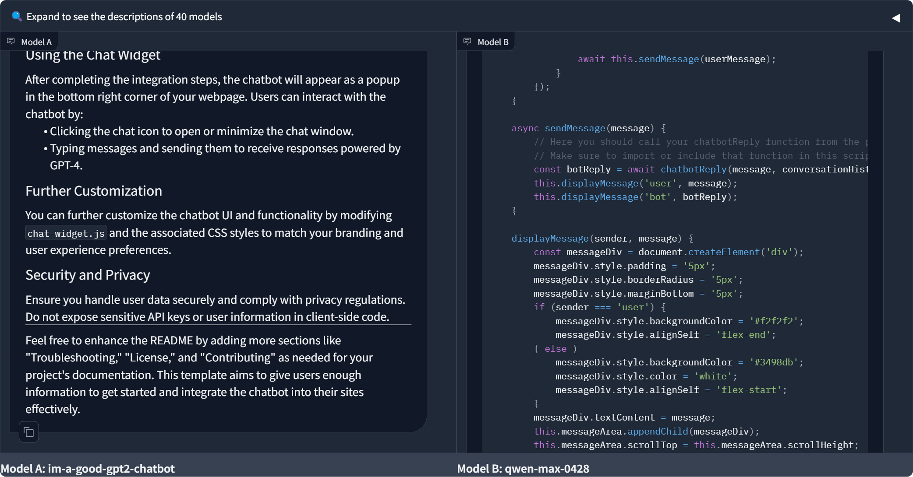

# Deployable Chatbot Widget
# Made with: Model A: im-a-good-gpt2-chatbot


This project creates a deployable chatbot that can be embedded as a JavaScript widget in multiple external websites. The chatbot utilizes the latest OpenAI GPT-4 model to process and respond to user inputs. It features conversation embeddings for recall and memory and can perform similarity searches over the conversation history. Additionally, it can collect user information (name, email, phone number) and submit this data to a specified CRM endpoint.

## Features

- **GPT-4 Powered Conversations:** Leverage the latest GPT-4 model for rich, context-aware conversations.
- **Embeddable JavaScript Widget:** Easy to deploy on any webpage with minimal setup.
- **Conversation Embeddings:** Stores conversation history using embeddings for advanced recall and memory functionalities.
- **Data Collection:** Gathers user information and submits it to a CRM.
- **Customizable UI:** A popup chat interface that can be minimized to a chat icon.

## Prerequisites

Before you begin, ensure you have the following:

- Node.js and npm installed on your machine.
- An OpenAI API key to use GPT-4.
- Access to a CRM where you can submit user data via HTTP POST.

## Setup Instructions

### 1. Clone the Repository

Start by cloning this repository to your local machine:

```bash
git clone https://github.com/webdevtodayjason/marketingchatbot.git
cd marketingchatbot
```

### 2. Install Dependencies

Use npm to install all required dependencies:

```bash
npm init -y
npm install express axios dotenv openai body-parser cors
```

### 3. Set Up Environment Variables

Create a `.env` file in the root of your project and update it with your OpenAI API key and CRM URL:

```plaintext
OPENAI_API_KEY=your_openai_api_key
CRM_URL=your_crm_endpoint_url
```

### 4. Run the Backend Server

Launch the Node.js server which will handle requests from the chat widget:

```bash
node server.js
```

## Integrating the Chat Widget

To integrate the chat widget into any external website, follow these steps:

### 1. Include Font Awesome

Add Font Awesome to your HTML to use icons in the chat widget. Add this line in the `<head>` section of your HTML:

```html
<link href="https://cdnjs.cloudflare.com/ajax/libs/font-awesome/6.0.0-beta3/css/all.min.css" rel="stylesheet">
```

### 2. Deploy the Chat Widget JavaScript

1. **Host `chat-widget.js`:** Make sure the `chat-widget.js` file is hosted on a public URL.
2. **Include the Script:** Add the following script tag to the `<head>` of your HTML on every site where you want the chatbot to appear:

```html
<script src="URL_TO_YOUR_CHAT_WIDGET_JS"></script>
```

### 3. Ensure CORS Configuration

Make sure your backend is configured to accept requests from the domains where the chatbot will be embedded. In your Node.js server, use the `cors` package:

```javascript
const cors = require('cors');
app.use(cors());
```

## Using the Chat Widget

After completing the integration steps, the chatbot will appear as a popup in the bottom right corner of your webpage. Users can interact with the chatbot by:

- Clicking the chat icon to open or minimize the chat window.
- Typing messages and sending them to receive responses powered by GPT-4.

## Further Customization

You can further customize the chatbot UI and functionality by modifying `chat-widget.js` and the associated CSS styles to match your branding and user experience preferences.

## Security and Privacy

Ensure you handle user data securely and comply with privacy regulations. Do not expose sensitive API keys or user information in client-side code.

---

Feel free to enhance the README by adding more sections like "Troubleshooting," "License," and "Contributing" as needed for your project's documentation. This template aims to give users enough information to get started and integrate the chatbot into their sites effectively.
